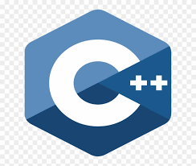
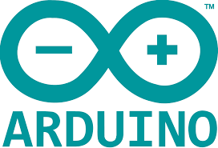
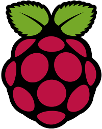

<h1 align="center">Hi 👋, I'm Simon Ernst</h1>
<h3 align="center">A passionate Robotic Engineer from France</h3>

- 🔭 I’m currently working on :
   - [Car-Logger](https://github.com/simonernst/car-logger)
   - [RoboCup](https://github.com/Robocup-Lyontech/robocup-main)

- 🌱 I’m currently learning **OBD protocol & Docker**

- 💬 Ask me about **ROS, Robotics, Autonomous Vehicles**

- My setup :
   - Lenovo Y540 - i5 4C/8T, 16Go RAM, GTX1660Ti (6Go)
   - Windows 10 - Insider Development builds
   - WSL 2 with GPU integration + Docker GPU support

<h3 align="left">Platforms and Tools:</h3>

 

  
<h3 align="left">Programming Languages:</h3>

 

<h3 align="left">Hardware:</h3>

 

&nbsp;

  

  

<h3 align="left">Connect with me:</h3>

